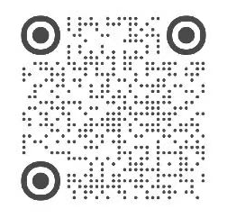

<a id="top"></a>

<p align="center">
  <a href="#zh-cn"><strong>简体中文</strong></a> ·
  <a href="#en"><strong>English</strong></a>
</p>

---

<a id="zh-cn"></a>

<h1 align="center">⌨️ AhaKey Community</h1>

<p align="center">
  <strong>面向 AI 编程与桌面工作流的开放硬件入口</strong>
</p>

<p align="center">
  官方硬件 · 桌面客户端 · BLE 协议 · Awesome AhaKey · 受控硬件共创
</p>

<p align="center">
  <a href="https://github.com/AhakeyAI/desktop/releases"></a>
  <a href="https://github.com/AhakeyAI/desktop"></a>
  <a href="https://github.com/AhakeyAI/protocol"></a>
  <a href="https://github.com/AhakeyAI/awesome-ahakey"></a>
  <a href="https://github.com/orgs/AhakeyAI/discussions"></a>
</p>

---

## AhaKey 是什么？

AhaKey 是一个面向 AI 编程与桌面工作流的开放硬件项目。我们希望把键盘、语音输入、AI coding agent、桌面状态反馈和社区 workflow 连接起来，让开发者可以更自然地控制 Claude、Cursor、Codex 等 AI 编程工具。

AhaKey 不是只卖一个键盘，而是希望长期建设：

```text
硬件入口
→ 桌面客户端
→ BLE 协议
→ 第三方客户端 / workflow
→ Awesome AhaKey
→ 受控硬件 / 固件共创
```

---

## AhaKey 的开放共创机制

AhaKey 采用 **“开源客户端 + 开放协议 + Awesome AhaKey 社区共创 + 受控硬件资料”** 的分层开放机制。

我们默认开放：

- 官方桌面客户端源码
- BLE 协议文档
- 客户端开发示例
- Awesome AhaKey / 社区项目展示入口
- 第三方客户端、脚本、workflow、教程共创入口

第三方客户端、脚本、workflow、教程、非敏感硬件二创等，默认提交到 **Awesome AhaKey**；硬件 / 固件相关反馈、patch、proposal 和实验记录，才提交到受控硬件贡献仓库。

PCB layout、Gerber、BOM、生产测试资料等更完整硬件资料不默认通过仓库开放，如确有需要请联系企业微信专人客服进一步沟通。

> **AhaKey 尊重用户对自己设备的本地控制权。**  
> 我们不会故意通过远程认证、云端锁定或固件更新，破坏已公开协议下的合理本地开发和第三方客户端使用。

---

## 你来到这里，通常是想做这些事

### 入门版

| 你想做什么 | 去哪里 | 说明 |
|---|---|---|
| 直接使用官方客户端 | [`desktop/releases`](https://github.com/AhakeyAI/desktop/releases) | 下载官方桌面客户端安装包 |
| 查看 / 修改官方桌面端源码 | [`desktop`](https://github.com/AhakeyAI/desktop) | 官方桌面客户端源码，客户端贡献走这里 |
| 自己做客户端 / 工具 / workflow | [`protocol`](https://github.com/AhakeyAI/protocol) | 阅读 BLE 协议，开发第三方客户端、脚本或 AI workflow |
| 欣赏并 Fork 别人的二创 | [`awesome-ahakey`](https://github.com/AhakeyAI/awesome-ahakey) | 查看社区项目、教程、workflow、桌面 setup |
| 提交自己的项目 / 教程 / workflow | [`awesome-ahakey`](https://github.com/AhakeyAI/awesome-ahakey) | 第三方客户端、脚本、workflow、教程默认提交到这里 |

### 进阶版

| 你想做什么 | 去哪里 | 说明 |
|---|---|---|
| 发现官方客户端 bug | [`desktop/issues`](https://github.com/AhakeyAI/desktop/issues) | 提交明确问题、复现步骤、日志或截图 |
| 有想法想先讨论 | [`Discussions`](https://github.com/orgs/AhakeyAI/discussions) | 发起问题、想法、玩法、共创讨论 |
| 需要查看官方硬件 / 固件基线源码 | [`Hardware Source Access Program`](https://ahakey.com/cn/hardware-source/apply) | 先提交表单，通过后按 GitHub 用户名加入私有仓库 |
| 已获授权，想查看官方固件基线 | [`AhaKey-X1-hardware-source`](https://github.com/AhakeyAI/AhaKey-X1-hardware-source) | 受控私有仓库，用于查看官方基线、Release、烧录说明 |
| 已获授权，想提交硬件 / 固件 patch、proposal、实验记录 | [`AhaKey-X1-hardware-contributions`](https://github.com/AhakeyAI/AhaKey-X1-hardware-contributions) | 只接收硬件 / 固件相关反馈，不接收普通客户端和 workflow |
| 需要 PCB layout / BOM / Gerber / 生产测试资料 | 企业微信专人客服 | 不默认通过仓库开放，需要单独沟通评估 |

> 提交 Hardware Source Access Program 表单时，请真实填写 GitHub 用户名。  
> 如果申请通过，我们会根据表单里的 GitHub 用户名，把你加入对应的私有仓库。

---

## 仓库说明

<div align="center">

<table>
  <tr>
    <th>仓库</th>
    <th>用途</th>
    <th>适合谁看</th>
  </tr>
  <tr>
    <td><a href="https://github.com/AhakeyAI/desktop"><strong>desktop</strong></a></td>
    <td>官方桌面客户端</td>
    <td>想使用、构建、修改官方客户端的人</td>
  </tr>
  <tr>
    <td><a href="https://github.com/AhakeyAI/protocol"><strong>protocol</strong></a></td>
    <td>AhaKey BLE 协议与客户端开发参考</td>
    <td>想自己做客户端、脚本、工具、workflow 的人</td>
  </tr>
  <tr>
    <td><a href="https://github.com/AhakeyAI/awesome-ahakey"><strong>awesome-ahakey</strong></a></td>
    <td>社区项目、教程、workflow 展示</td>
    <td>想看二创、Fork 别人项目、提交自己作品的人</td>
  </tr>
  <tr>
    <td><a href="https://github.com/AhakeyAI/AhaKey-X1-hardware-source"><strong>AhaKey-X1-hardware-source</strong></a></td>
    <td>官方硬件 / 固件基线源码仓库</td>
    <td>已获授权、想查看官方固件源码、官方 Release、烧录说明的人</td>
  </tr>
  <tr>
    <td><a href="https://github.com/AhakeyAI/AhaKey-X1-hardware-contributions"><strong>AhaKey-X1-hardware-contributions</strong></a></td>
    <td>硬件 / 固件用户贡献暂存仓库</td>
    <td>已获授权、想提交硬件 / 固件 patch、proposal、实验记录的人</td>
  </tr>
  <tr>
    <td><a href="https://github.com/AhakeyAI/.github"><strong>.github</strong></a></td>
    <td>组织级贡献规则、Issue / PR 模板、社区支持信息</td>
    <td>准备提交 Issue、PR 或参与社区协作的人</td>
  </tr>
</table>

</div>

> `AhaKey-X1-hardware-source` 和 `AhaKey-X1-hardware-contributions` 是受控私有仓库。  
> 如果你没有访问权限，打开时可能会看到 404 或无权限提示，这是正常的。请先通过硬件源码访问计划提交说明。

---

## 社区贡献和硬件贡献怎么分？

| 类型 | 默认去哪里 | 说明 |
|---|---|---|
| 官方桌面客户端 bug / 功能改进 | [`desktop`](https://github.com/AhakeyAI/desktop) | 官方客户端代码贡献走公开 PR |
| BLE 协议文档 / examples | [`protocol`](https://github.com/AhakeyAI/protocol) | 协议和开发示例走公开仓库 |
| 第三方客户端 / 脚本 / workflow / 教程 | [`awesome-ahakey`](https://github.com/AhakeyAI/awesome-ahakey) | 社区项目、教程和 workflow 默认提交到这里 |
| 外壳、键帽、支架、桌面 setup 等非敏感二创 | [`awesome-ahakey`](https://github.com/AhakeyAI/awesome-ahakey) | 可展示成果，不提交生产级硬件资料 |
| 官方固件 bug / 固件 patch / 烧录文档补充 | [`AhaKey-X1-hardware-contributions`](https://github.com/AhakeyAI/AhaKey-X1-hardware-contributions) | 仅限已获授权用户 |
| 硬件 proposal / 原理图反馈 / 底层调试记录 | [`AhaKey-X1-hardware-contributions`](https://github.com/AhakeyAI/AhaKey-X1-hardware-contributions) | 仅限硬件 / 固件相关内容 |
| PCB layout / Gerber / BOM / 生产测试资料 | 企业微信专人客服 | 不默认通过仓库提供 |

### 硬件 / 固件贡献必须新建分支

如果你已经获得 `AhaKey-X1-hardware-contributions` 访问权限，无论提交 bug fix、文档、proposal、实验记录，还是硬件反馈，都请**新建分支**提交。

请不要直接提交到：

```text
main
master
```

推荐分支命名：

```text
fix/<github-id>-short-description
docs/<github-id>-short-description
experiment/<github-id>-short-description
proposal/<github-id>-short-description
hardware/<github-id>-short-description
```

这样可以清晰保留贡献者的 GitHub 身份和提交记录，也方便 AhaKey 团队 review、讨论和后续鸣谢。

---

## 推荐路径

### 1）我想直接使用官方客户端

```text
进入 desktop/releases
→ 下载最新版本
→ 安装桌面客户端
→ 连接 AhaKey
→ 开始使用
```

入口：[`desktop/releases`](https://github.com/AhakeyAI/desktop/releases)

---

### 2）我想自己做客户端 / 工具 / workflow

```text
进入 protocol
→ 阅读 BLE 协议
→ 参考 examples
→ 创建自己的 repo
→ 做出 demo
→ 提交到 awesome-ahakey
```

适合：

- 自己写 macOS / Windows 客户端
- 做 Cursor / Claude / Codex 工作流工具
- 做快捷键脚本
- 做 OLED / RGB / 配置工具
- 做自动化集成

入口：[`protocol`](https://github.com/AhakeyAI/protocol)

---

### 3）我想修改官方桌面客户端

```text
进入 desktop
→ 阅读 README
→ Fork 仓库
→ 修改代码
→ 本地测试
→ 提交 Pull Request
```

适合：

- 修 bug
- 改 UI
- 优化安装体验
- 增加 macOS / Windows 适配
- 改进官方默认体验

入口：[`desktop`](https://github.com/AhakeyAI/desktop)

---

### 4）我做了一个独立版本，想分享给社区

```text
进入 awesome-ahakey
→ 按模板提交项目
→ 社区收录
→ 优秀功能可进一步评估是否进入官方 desktop
```

适合：

- 第三方客户端
- 工具脚本
- 使用教程
- 工作流 preset
- 桌面 setup 展示
- 视频 / 图文教程
- 非敏感硬件二创，例如外壳、键帽、支架、桌面 setup

入口：[`awesome-ahakey`](https://github.com/AhakeyAI/awesome-ahakey)

---

### 5）我想参与硬件 / 固件深度共创

```text
提交 Hardware Source Access Program 表单
→ 真实填写 GitHub 用户名
→ AhaKey 团队判断用途
→ 通过后邀请你的 GitHub 账号进入对应私有仓库
→ 查看官方基线源码
→ 本地学习、编译、调试和实验
→ 在贡献仓库中新建分支提交硬件 / 固件反馈或 patch
→ AhaKey 团队 review
```

入口：[`AhaKey 硬件源码访问计划`](https://ahakey.com/cn/hardware-source/apply)

---

## Issue / Discussion / PR / awesome-ahakey 分别用来做什么？

| 类型 | 用途 | 适合什么时候用 |
|---|---|---|
| Issue | 明确问题或明确需求 | bug、文档错误、可复现问题、具体功能请求 |
| Discussion | 开放讨论和想法孵化 | 玩法讨论、共创想法、不确定的问题、高关注度话题 |
| Pull Request | 提交具体改动 | 代码修改、文档修改、bug fix、功能实现 |
| awesome-ahakey | 社区作品展示 | 独立项目、第三方客户端、脚本、教程、workflow、二创展示 |
| hardware-contributions | 受控硬件 / 固件贡献暂存 | 固件 patch、实验记录、硬件 proposal、烧录文档补充 |

简单理解：

```text
不确定 → 先 Discussion
明确问题 → 提 Issue
客户端 / 文档已改好 → 提 Pull Request
做了独立项目或 workflow → 提到 awesome-ahakey
涉及官方硬件 / 固件源码 → 走 Hardware Source Access Program
```

---

## 社区维护入口

这些文件不是新的用户入口，而是 AhaKey 社区的基础维护规则。  
普通用户不需要一开始全部阅读；当你准备提 Issue、PR、报告安全问题或参与社区协作时，再查看对应文档即可。

| 你想做什么 | 看这里 | 说明 |
|---|---|---|
| 了解如何提交 Issue / PR / 社区项目 | [`CONTRIBUTING.md`](https://github.com/AhakeyAI/.github/blob/main/CONTRIBUTING.md) | 贡献规则、PR 流程、哪些内容适合提交到官方或社区 |
| 遇到使用、构建、连接、协议问题 | [`SUPPORT.md`](https://github.com/AhakeyAI/.github/blob/main/SUPPORT.md) | 遇到问题时该去哪个仓库、需要提供什么信息 |
| 报告安全问题、密钥泄露、隐私风险 | [`SECURITY.md`](https://github.com/AhakeyAI/.github/blob/main/SECURITY.md) | 安全问题请不要公开发 Issue，按安全流程联系团队 |
| 了解社区基本行为规范 | [`CODE_OF_CONDUCT.md`](https://github.com/AhakeyAI/.github/blob/main/CODE_OF_CONDUCT.md) | 保持友好、尊重、建设性的社区协作氛围 |

---

## 贡献方式

你可以贡献：

- bug report
- 文档修正
- 安装教程
- macOS / Windows 客户端改进
- BLE 协议反馈
- 第三方客户端
- workflow / preset / 脚本
- 使用视频、截图、教程
- 非敏感硬件二创展示
- 固件问题反馈、patch、proposal、实验记录

建议尽量保持：

- 小步提交
- 说明清楚
- 有截图 / 日志 / demo 更好
- 不提交密钥、token、私人文件
- 大功能先 Discussion，再 PR
- 硬件 / 固件贡献进入贡献仓库时，必须新建分支，不直接提交 main / master

---

## 官方入口、问题反馈与社群

如果你想了解 AhaKey、下载软件、购买设备、加入讨论或联系官方，可以从下面这些入口开始。

| 入口 | 链接 | 适合做什么 |
|---|---|---|
| 官网 | [ahakey.com](https://ahakey.com) | 产品介绍、下载入口、社区说明、硬件源码访问计划 |
| GitHub | [AhakeyAI](https://github.com/AhakeyAI) | 开源代码、协议文档、Issue、PR、社区项目 |
| Discord | [AhaKey Discord](https://discord.gg/Nn48cJXa) | 海外用户交流、开发者讨论、快速反馈 |
| X / Twitter | [@zhngxnyng199073](https://x.com/zhngxnyng199073) | 海外动态、产品更新、开发者内容 |
| 哔哩哔哩 | [AhaKey Bilibili](https://space.bilibili.com/2001376117?spm_id_from=333.1007.0.0) | 视频教程、产品演示、开发过程记录 |
| 淘宝店 | [AhaKey 淘宝店](https://shop277996828.taobao.com/?spm=pc_detail.30350276.shop_block.dshopinfo.5ad17dd6tWyean) | 购买设备、订单相关问题 |
| 官方邮箱 | [zhangxinyang@ahakey.cn](mailto:zhangxinyang@ahakey.cn) | 合作、反馈、社区问题、重要问题联系 |

### 问题该去哪里？

| 你遇到的问题 | 推荐入口 |
|---|---|
| 官方客户端 bug、安装失败、连接异常 | GitHub Issues |
| 协议开发、第三方客户端、workflow 想法 | GitHub Discussions |
| 想展示自己的二创项目、教程、脚本 | awesome-ahakey |
| 想提交固件 patch、实验记录、硬件 proposal | AhaKey-X1-hardware-contributions |
| 需要查看官方固件基线源码 | Hardware Source Access Program |
| 需要 PCB layout、BOM、Gerber、生产测试资料 | 企业微信专人客服 |
| 购买、发货、售后、设备使用问题 | 淘宝店 / 企业微信客服 |
| 中文用户日常交流 | 微信群 / QQ 群 / 小红书群 |
| 海外用户交流 | Discord / X |
| 安全问题、密钥泄露、受控资料泄露 | 请勿公开发 Issue，联系官方邮箱 |

<details>
<summary><strong>扫码加入中文社群 / 联系客服</strong></summary>

<br>

<div align="center">

<table>
  <tr>
    <th>微信公众号</th>
    <th>微信讨论群</th>
    <th>QQ 讨论群</th>
  </tr>
  <tr>
    <td align="center"><br>关注公众号</td>
    <td align="center"><br>加入微信讨论群</td>
    <td align="center"><br>加入 QQ 讨论群</td>
  </tr>
  <tr>
    <th>小红书群</th>
    <th>企业微信客服</th>
    <th>更多入口</th>
  </tr>
  <tr>
    <td align="center"><br>加入小红书群</td>
    <td align="center"><br>联系专人客服</td>
    <td align="center"><a href="https://ahakey.com">ahakey.com</a><br>官网与下载入口</td>
  </tr>
</table>

</div>

</details>

<p align="right"><a href="#top">↑ Back to top</a></p>

---

<a id="en"></a>

<h1 align="center">⌨️ AhaKey Community</h1>

<p align="center">
  <strong>An open hardware entry point for AI coding and desktop workflows</strong>
</p>

<p align="center">
  Official Hardware · Desktop Client · BLE Protocol · Awesome AhaKey · Controlled Hardware Collaboration
</p>

<p align="center">
  <a href="https://github.com/AhakeyAI/desktop/releases"></a>
  <a href="https://github.com/AhakeyAI/desktop"></a>
  <a href="https://github.com/AhakeyAI/protocol"></a>
  <a href="https://github.com/AhakeyAI/awesome-ahakey"></a>
  <a href="https://github.com/orgs/AhakeyAI/discussions"></a>
</p>

---

## What is AhaKey?

AhaKey is an open hardware project for AI coding and desktop workflows. We connect keyboards, voice input, AI coding agents, desktop status feedback, and community workflows, so developers can control Claude, Cursor, Codex, and similar tools more naturally.

AhaKey is not just a keyboard. We are building:

```text
Hardware entry point
→ Desktop client
→ BLE protocol
→ Third-party clients / workflows
→ Awesome AhaKey
→ Controlled hardware / firmware collaboration
```

---

## AhaKey open collaboration model

AhaKey follows a layered openness model: **open-source client + open protocol + Awesome AhaKey community collaboration + controlled hardware materials**.

We open the official desktop client source code, BLE protocol documentation, client development examples, and Awesome AhaKey community showcase by default. We encourage developers to build their own clients, scripts, tools, and AI workflows based on the public protocol.

Third-party clients, scripts, workflows, tutorials, and non-sensitive hardware remixes should be submitted to **Awesome AhaKey** by default. Hardware / firmware feedback, patches, proposals, and experiments should go through the controlled hardware source access flow.

PCB layout, Gerber, BOM, production test materials, and other complete hardware production files are not provided through repositories by default. If needed, please contact AhaKey WeCom support for further discussion.

> **AhaKey respects users' local control over their own devices.**  
> We will not intentionally use remote authentication, cloud lock-in, or firmware updates to break reasonable local development or third-party clients built on published protocols.

---

## Start here

### Beginner

| What do you want to do? | Where to go | Notes |
|---|---|---|
| Use the official desktop client | [`desktop/releases`](https://github.com/AhakeyAI/desktop/releases) | Download the official desktop client |
| View / modify the official desktop source code | [`desktop`](https://github.com/AhakeyAI/desktop) | Official desktop client source; client contributions go here |
| Build your own client / tool / workflow | [`protocol`](https://github.com/AhakeyAI/protocol) | Read the BLE protocol and build your own client, script, or AI workflow |
| Explore and fork community projects | [`awesome-ahakey`](https://github.com/AhakeyAI/awesome-ahakey) | Browse community projects, tutorials, workflows, and setups |
| Submit your own project / tutorial / workflow | [`awesome-ahakey`](https://github.com/AhakeyAI/awesome-ahakey) | Third-party clients, scripts, workflows, and tutorials go here |

### Advanced

| What do you want to do? | Where to go | Notes |
|---|---|---|
| Report a desktop client bug | [`desktop/issues`](https://github.com/AhakeyAI/desktop/issues) | Submit clear reproduction steps, logs, or screenshots |
| Start a discussion | [`Discussions`](https://github.com/orgs/AhakeyAI/discussions) | Share ideas, questions, use cases, or collaboration topics |
| Need official hardware / firmware baseline source | [`Hardware Source Access Program`](https://ahakey.com/cn/hardware-source/apply) | Submit a form first; approved users may be added to private repositories by GitHub username |
| Authorized and want to read the official baseline | [`AhaKey-X1-hardware-source`](https://github.com/AhakeyAI/AhaKey-X1-hardware-source) | Controlled private repo for official baseline, Release, and flashing notes |
| Authorized and want to submit hardware / firmware patches, proposals, or experiments | [`AhaKey-X1-hardware-contributions`](https://github.com/AhakeyAI/AhaKey-X1-hardware-contributions) | Hardware / firmware only; not for general client or workflow submissions |
| Need PCB layout / BOM / Gerber / production test materials | WeCom support | Not provided through repositories by default; evaluated separately |

> Please provide your real GitHub username when submitting the Hardware Source Access Program form.  
> If approved, we will use that GitHub username to invite you to the relevant private repository.

---

## Repositories

<div align="center">

<table>
  <tr>
    <th>Repository</th>
    <th>Purpose</th>
    <th>Who should read it</th>
  </tr>
  <tr>
    <td><a href="https://github.com/AhakeyAI/desktop"><strong>desktop</strong></a></td>
    <td>Official desktop client</td>
    <td>Users or developers who want to use, build, or modify the official client</td>
  </tr>
  <tr>
    <td><a href="https://github.com/AhakeyAI/protocol"><strong>protocol</strong></a></td>
    <td>AhaKey BLE protocol and client development reference</td>
    <td>Developers building their own clients, scripts, tools, or workflows</td>
  </tr>
  <tr>
    <td><a href="https://github.com/AhakeyAI/awesome-ahakey"><strong>awesome-ahakey</strong></a></td>
    <td>Community projects, tutorials, and workflow showcase</td>
    <td>People browsing community projects or submitting their own work</td>
  </tr>
  <tr>
    <td><a href="https://github.com/AhakeyAI/AhaKey-X1-hardware-source"><strong>AhaKey-X1-hardware-source</strong></a></td>
    <td>Official hardware / firmware baseline source repository</td>
    <td>Authorized users who want to read official firmware source, official Releases, and flashing notes</td>
  </tr>
  <tr>
    <td><a href="https://github.com/AhakeyAI/AhaKey-X1-hardware-contributions"><strong>AhaKey-X1-hardware-contributions</strong></a></td>
    <td>Hardware / firmware contribution staging repository</td>
    <td>Authorized users submitting hardware / firmware patches, proposals, and experiments</td>
  </tr>
  <tr>
    <td><a href="https://github.com/AhakeyAI/.github"><strong>.github</strong></a></td>
    <td>Shared contribution rules, Issue / PR templates, and support information</td>
    <td>Contributors preparing to submit Issues, PRs, or community contributions</td>
  </tr>
</table>

</div>

> `AhaKey-X1-hardware-source` and `AhaKey-X1-hardware-contributions` are controlled private repositories.  
> If you do not have access, GitHub may show 404 or permission errors. Please submit the Hardware Source Access Program form first.

---

## Community contributions and hardware contributions

| Type | Default place | Notes |
|---|---|---|
| Official desktop client bugs / improvements | [`desktop`](https://github.com/AhakeyAI/desktop) | Client code contributions go through public PRs |
| BLE protocol docs / examples | [`protocol`](https://github.com/AhakeyAI/protocol) | Protocol and examples go to the public repo |
| Third-party clients / scripts / workflows / tutorials | [`awesome-ahakey`](https://github.com/AhakeyAI/awesome-ahakey) | Community projects, tutorials, and workflows go here by default |
| Cases, keycaps, stands, desk setup, and non-sensitive remixes | [`awesome-ahakey`](https://github.com/AhakeyAI/awesome-ahakey) | Showcase results, not production-grade hardware materials |
| Official firmware bugs / firmware patches / flashing docs | [`AhaKey-X1-hardware-contributions`](https://github.com/AhakeyAI/AhaKey-X1-hardware-contributions) | Authorized users only |
| Hardware proposals / schematic feedback / low-level debugging notes | [`AhaKey-X1-hardware-contributions`](https://github.com/AhakeyAI/AhaKey-X1-hardware-contributions) | Hardware / firmware only |
| PCB layout / Gerber / BOM / production test materials | WeCom support | Not provided through repositories by default |

### Always create a new branch for hardware / firmware contributions

If you have access to `AhaKey-X1-hardware-contributions`, always create a new branch for bug fixes, documentation, proposals, experiments, or hardware feedback.

Do not commit directly to:

```text
main
master
```

Recommended branch names:

```text
fix/<github-id>-short-description
docs/<github-id>-short-description
experiment/<github-id>-short-description
proposal/<github-id>-short-description
hardware/<github-id>-short-description
```

This keeps contributor identity and commit history clear, and makes review, discussion, and future credits easier.

---

## Recommended paths

### 1) I want to use the official desktop client

```text
Go to desktop/releases
→ Download the latest version
→ Install the desktop client
→ Connect AhaKey
→ Start using it
```

Entry: [`desktop/releases`](https://github.com/AhakeyAI/desktop/releases)

---

### 2) I want to build my own client / tool / workflow

```text
Go to protocol
→ Read the BLE protocol
→ Check examples
→ Create your own repo
→ Build a demo
→ Submit it to awesome-ahakey
```

Entry: [`protocol`](https://github.com/AhakeyAI/protocol)

---

### 3) I want to modify the official desktop client

```text
Go to desktop
→ Read the README
→ Fork the repository
→ Modify the code
→ Test locally
→ Submit a Pull Request
```

Entry: [`desktop`](https://github.com/AhakeyAI/desktop)

---

### 4) I built an independent project and want to share it

```text
Go to awesome-ahakey
→ Submit your project with the template
→ Get listed by the community
→ High-value features may later be evaluated for the official desktop
```

Entry: [`awesome-ahakey`](https://github.com/AhakeyAI/awesome-ahakey)

---

### 5) I want to join deeper hardware / firmware collaboration

```text
Submit the Hardware Source Access Program form
→ Provide your real GitHub username
→ AhaKey team reviews the purpose
→ Your GitHub account may be invited to the relevant private repository
→ Read the official baseline source
→ Learn, build, debug, and experiment locally
→ Submit hardware / firmware feedback or patches through a new branch in the contribution repository
→ AhaKey team reviews it
```

Entry: [`AhaKey Hardware Source Access Program`](https://ahakey.com/cn/hardware-source/apply)

---

## What are Issue / Discussion / PR / awesome-ahakey for?

| Type | Purpose | Best used for |
|---|---|---|
| Issue | Clear problems or concrete requests | bugs, documentation errors, reproducible problems, specific feature requests |
| Discussion | Open-ended discussion and idea incubation | workflows, ideas, uncertain questions, collaboration topics |
| Pull Request | Concrete changes | code changes, documentation changes, bug fixes, implemented features |
| awesome-ahakey | Community showcase | independent projects, third-party clients, scripts, tutorials, workflows, remixes |
| hardware-contributions | Controlled hardware / firmware contribution staging | firmware patches, experiments, hardware proposals, flashing docs |

Simple rule:

```text
Not sure → Discussion
Clear problem → Issue
Client / docs already changed → Pull Request
Built an independent project or workflow → awesome-ahakey
Official hardware / firmware source involved → Hardware Source Access Program
```

---

## Community maintenance files

These files are not extra entry points for new users.  
They are the basic rules and support files that help keep the AhaKey community maintainable.

| What do you want to do? | Read this | Notes |
|---|---|---|
| Learn how to submit Issues, PRs, or community projects | [`CONTRIBUTING.md`](https://github.com/AhakeyAI/.github/blob/main/CONTRIBUTING.md) | Contribution rules, PR flow, and what belongs in official repos or community projects |
| Get help with usage, builds, connection, or protocol questions | [`SUPPORT.md`](https://github.com/AhakeyAI/.github/blob/main/SUPPORT.md) | Where to ask questions and what information to provide |
| Report security issues, leaked secrets, or privacy risks | [`SECURITY.md`](https://github.com/AhakeyAI/.github/blob/main/SECURITY.md) | Please do not open public Issues for security problems |
| Understand community behavior expectations | [`CODE_OF_CONDUCT.md`](https://github.com/AhakeyAI/.github/blob/main/CODE_OF_CONDUCT.md) | Keep the community friendly, respectful, and constructive |

---

## Ways to contribute

You can contribute:

- bug reports
- documentation improvements
- installation guides
- macOS / Windows client improvements
- BLE protocol feedback
- third-party clients
- workflows / presets / scripts
- videos, screenshots, and tutorials
- non-sensitive hardware remixes
- firmware feedback, patches, proposals, and experiments

Please try to keep contributions:

- small and reviewable
- clearly explained
- accompanied by screenshots / logs / demos when helpful
- free of secrets, tokens, or personal files
- discussed first if the feature is large
- submitted through a new branch if it involves controlled hardware / firmware contribution

---

## Official links, feedback, and support

If you want to learn about AhaKey, download software, buy the device, join discussions, or contact the team, start here.

| Entry | Link | Best for |
|---|---|---|
| Website | [ahakey.com](https://ahakey.com) | Product information, downloads, community info, hardware source access program |
| GitHub | [AhakeyAI](https://github.com/AhakeyAI) | Source code, protocol docs, Issues, PRs, community projects |
| Discord | [AhaKey Discord](https://discord.gg/Nn48cJXa) | International community, developer discussions, quick feedback |
| X / Twitter | [@zhngxnyng199073](https://x.com/zhngxnyng199073) | Product updates, development notes, international posts |
| Bilibili | [AhaKey Bilibili](https://space.bilibili.com/2001376117?spm_id_from=333.1007.0.0) | Videos, tutorials, product demos, development logs |
| Taobao Store | [AhaKey Taobao Store](https://shop277996828.taobao.com/?spm=pc_detail.30350276.shop_block.dshopinfo.5ad17dd6tWyean) | Purchase, orders, device-related questions |
| Email | [zhangxinyang@ahakey.cn](mailto:zhangxinyang@ahakey.cn) | Collaboration, feedback, community issues, important contact |

### Where should I ask?

| What you need | Recommended place |
|---|---|
| Official client bugs, installation failures, connection issues | GitHub Issues |
| Protocol development, third-party clients, workflow ideas | GitHub Discussions |
| Sharing your own project, tutorial, script, or workflow | awesome-ahakey |
| Submitting firmware patches, experiments, or hardware proposals | AhaKey-X1-hardware-contributions |
| Reading official firmware baseline source | Hardware Source Access Program |
| PCB layout, BOM, Gerber, production test materials | WeCom support |
| Purchase, shipping, after-sales, device usage | Taobao / WeCom support |
| Chinese community discussion | WeChat / QQ / Xiaohongshu groups |
| International community discussion | Discord / X |
| Security issues, leaked secrets, controlled material leaks | Do not open a public Issue; contact the official email |

<details>
<summary><strong>Chinese community QR codes / support contact</strong></summary>

<br>

<div align="center">

<table>
  <tr>
    <th>WeChat Official Account</th>
    <th>WeChat Group</th>
    <th>QQ Group</th>
  </tr>
  <tr>
    <td align="center"><br>Follow us</td>
    <td align="center"><br>Join WeChat group</td>
    <td align="center"><br>Join QQ group</td>
  </tr>
  <tr>
    <th>Xiaohongshu Group</th>
    <th>WeCom Support</th>
    <th>More</th>
  </tr>
  <tr>
    <td align="center"><br>Join Xiaohongshu group</td>
    <td align="center"><br>Contact support</td>
    <td align="center"><a href="https://ahakey.com">ahakey.com</a><br>Website and downloads</td>
  </tr>
</table>

</div>

</details>

<p align="right"><a href="#top">↑ Back to top</a></p>
